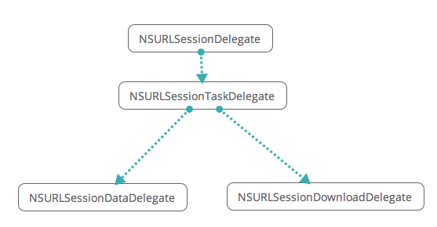

# NSUrlSeessionTest
NSURLSession 之NSURLSessionDataTask   NSURLSessionDownloadTask 
按常用功能分类，NSURLSession有以下几点用途：

1.请求数据

2.上传数据

3.下载数据

//数据任务创建

- (NSURLSessionDataTask *)dataTaskWithRequest:(NSURLRequest *)request;

- (NSURLSessionDataTask *)dataTaskWithURL:(NSURL *)url;

//上传任务创建

- (NSURLSessionUploadTask *)uploadTaskWithRequest:(NSURLRequest *)request fromFile:(NSURL *)fileURL;

- (NSURLSessionUploadTask *)uploadTaskWithRequest:(NSURLRequest *)request fromData:(NSData *)bodyData;

- (NSURLSessionUploadTask *)uploadTaskWithStreamedRequest:(NSURLRequest *)request;

//下载任务创建 

- (NSURLSessionDownloadTask *)downloadTaskWithRequest:(NSURLRequest *)request;

- (NSURLSessionDownloadTask *)downloadTaskWithURL:(NSURL *)url;

- (NSURLSessionDownloadTask *)downloadTaskWithResumeData:(NSData *)resumeData;
